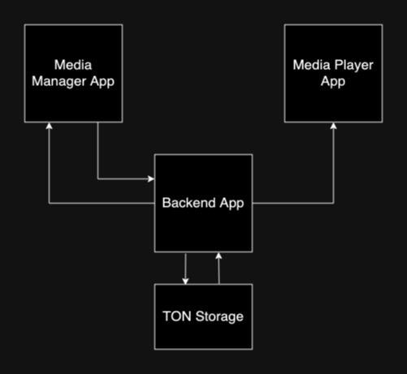

[](https://github.com/it-beard/itbeard-in-ton/blob/main/LICENSE)
[](https://github.com/it-beard/itbeard-in-ton/stargazers)
[](https://github.com/it-beard/itbeard-in-ton/issues)

# MEDIA MIRROR
> TON Storage-based dapp for storing large media files inside Telegram with the ability to play them within Telegram.

# Introduction
```Media Mirror``` is a project that is a simple media storage of ```.mp4``` video files using ```TON Storage``` and with the ability to play these files in Telegram messenger directly from ```TON Storage```. 

This project should help YouTube bloggers and video content creators from other platforms to disconnect from their main platforms, upload their content directly to the TON network, and interact with it through the TON and Telegram ecosystems.

YouTube channel [АйТиБорода](https://youtube.com/@itbeard) will act as the first test consumer of the project.

${\textsf{\color{red}IMPORTANT}}$$ This project is being developed as part of ```HACK-TON-BERFEST 2023```. Read more about the conditions of participation in the hackathon, participating projects, and prizes [here](https://society.ton.org/hack-ton-berfest-2023).


# High-level project implementation


## Media Manager App
Frontend application for interacting with media files in TON Storage.  Interaction takes place via the ```Backend App```. It can be either a regular Web App or a Telegram App. Allows you to do the following actions with files:
- Upload a file
- View the list of uploaded files
- Delete a file.

The App must be protected by Telegram authentication and have a whitelist of users who can be authorized and have access to actions on stored files. 

## Backend App 
Backend application for interacting with media files in TON Storage. Has an API. Has authentication via Telegram whitelist of users who can be authorized in the application. Has the following endpoints:

#### With authentication:
- Uploading a file (file size from 5Mb to 50GB, extension ```.mp4```)
- Deleting a file
- Get a list of files

#### Without authentication:
- Get file to play in Media Player App (think how to implement)

## Media Player App
Frontend application that can play files from TON Storage. The application with a specific file to be played should be opened by clicking on a special link inside a Telegram channel post, or be able to be embedded into a post in a Telegram channel

# How to Contribute
0. Registration: Connect your [wallet]("https://tonkeeper.com/") and fill your GitHub and Telegram accounts in [ton society](https://society.ton.org/)
1. Fork & Clone: Fork this repository and clone it to your local machine.
2. Pick an Issue: Browse open [issues](https://github.com/it-beard/itbeard-in-ton/issues), choose one that interests you, and commit to it.
3. Code Away: Address the issue in your local environment.
4. Pull Request: Submit a PR for review. Please ensure your PR title is clear and your description is detailed.
5. Contact the team: notify the [@itbeard](https://github.com/itbeard) for check the code and PR approval.
6. Have FUN!!! 😊


>Video tutorial: If you prefer visual learning, check out this video tutorial [EN](https://www.youtube.com/channel/UCaiBZhZWqYeeQMUeCev18ng), [RU](https://www.youtube.com/playlist?list=PLOIvUFGfwP93tZI_WnaLyJsZlskU4ao92) on contributing!


## Community
* Team Chat (Russian language): https://t.me/itbeard_in_ton
* Team Chat (English language): https://t.me/itbeard_in_ton_en

